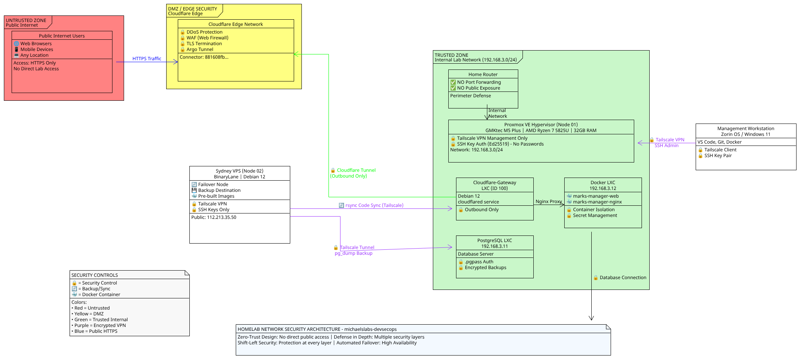

# homelab-infrastructure

## Proxmox

## DevSecOps

## Docker-Compose

## Network Security
Edge Ingress Strategy I utilize a Cloudflare Tunnel (Connector ID: 881608fb...) to expose internal services securely.

**Mechanism:** The tunnel runs inside a isolated Proxmox LXC (Cloudflare-Gateway) using a secure cloudflared service.

**Benefit:** This architecture hides the home lab's public IP and prevents direct external scans of the local network.

### Security Architecture

- **Zero-Trust Design:** No direct public access to internal services
- **Defense in Depth:** Multiple security layers at each zone
- **Key Security Controls:**
  - Cloudflare Edge (DDoS, WAF, TLS Termination)
  - Tailscale VPN for all management access
  - SSH key authentication only (ed25519)
  - Container isolation with secret management
  - Encrypted database backups via Tailscale tunnel.

[View Security Model Documentation](./docs/security-model.md)

## 🛠 Hardware Stack
This environment utilizes a hybrid-cloud architecture consisting of local Proxmox hypervisors and high-performance cloud gateways.
- **Node 01**: GMKtec M5 Plus (Proxmox VE)
- **Node 02**: BinaryLane VPS (Debian 12)
- [View Detailed Hardware Specifications](./docs/hardware.md)

## 📂 Project Structure
- **docs/**: Detailed hardware specs and the security model governing the lab.
- **infrastructure/**: Configuration and setup files for services.
  - **docker/**: Production-ready Docker Compose and Dockerfile configurations.
  - **scripts/**: Automated operations and system maintenance.
    - **monitor/**: Health checks and status reporting (heartbeat, status checks).
    - **sync/**: Data synchronization and backup automation.
    - **system/**: Failover, migration, and maintenance operations.
    - **backup/**: Backup and archival operations.
    - **maintenance/**: Routine maintenance tasks.
    - **security/**: Security scanning and hardening.
    - **logs/**: Execution logs and outputs.
- **vps-gateway/**: VPS gateway configuration and deployment.
- **CHANGELOG.md**: A detailed audit trail of all infrastructure modifications.

## 🚀 Quick Start
See [infrastructure/scripts/](./infrastructure/scripts/) for automation setup and cron job configuration.